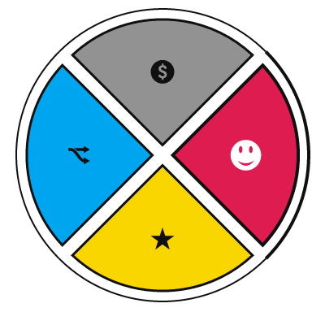

wheelnav.js
===========

[](https://gitter.im/softwaretailoring/wheelnav?utm_source=badge&utm_medium=badge&utm_campaign=pr-badge&utm_content=badge)

Animated wheel navigation JavaScript library based on [modified][modifiedraphael] [Raphaël.js][raphaeljs] (SVG/VML).

It works on all major desktop and mobile browser.

Possible uses:
- [tab navigation][wheelizatetabs]
- [pie menu (radial menu, circular menu)][pmg]
- sub menu
- option button
- checkboxes
- and more...

For more insight please visit [https://wheelnavjs.softwaretailoring.net][projectpage]  
Demos are available on [CodePen][codepen]  
You can find answers on [StackOverflow][stackoverflow] and [GitHub issues][issues]

## Using

### Via JavaScript

HTML
```html
<div id="divWheelnav"></div>
```

JS
```javascript
var myWheelnav = new wheelnav("divWheelnav");
myWheelnav.slicePathFunction = slicePath().WheelSlice;
myWheelnav.colors = colorpalette.parrot;
myWheelnav.createWheel([icon.smile, icon.star, icon.fork, icon.$]);
```

### Via data attributes

HTML
```html
<div id="divWheelnav" data-wheelnav data-wheelnav-slicepath="WheelSlice" data-wheelnav-colors="#D80351,#F5D908,#00A3EE,#929292">
    <div data-wheelnav-navitemicon="smile">smile</div>
    <div data-wheelnav-navitemicon="star">star</div>
    <div data-wheelnav-navitemicon="fork">fork</div>
    <div data-wheelnav-navitemicon="$">donate</div>
</div>
```

JS
```javascript
var myWheelnav = new wheelnav("divWheelnav");
```



The index.html of this repo (test page) is available [here][testpage].

## Install

wheelnav.js is available over [npm][npm]

```sh
$ npm install wheelnav
```

and [bower][bower]

```sh
$ bower install wheelnav
```

or CDN by [jsDelivr][jsdelivr]

```html
<script src="https://cdn.jsdelivr.net/npm/wheelnav@1.7.1/js/dist/raphael.min.js"></script>
<script src="https://cdn.jsdelivr.net/npm/wheelnav@1.7.1/js/dist/wheelnav.min.js"></script>
```  
[](https://www.jsdelivr.com/package/npm/wheelnav)

## Author

Developer: Gábor Berkesi (gabor.berkesi@softwaretailoring.net)

Development environment: [Visual Studio Community 2019][vs2019]

## License

Licensed under [MIT][mit]. Enjoy the spinning.

<a target="_blank" href="https://www.buymeacoffee.com/sftwrtlrng"><span style="margin-left:5px">Buy me a beer</span></a> - if you want to keep in spinning. Thanks a lot!

[projectpage]: https://wheelnavjs.softwaretailoring.net
[testpage]: https://wheelnavjs.softwaretailoring.net/test
[mit]: https://opensource.org/licenses/mit-license.php
[raphaeljs]: https://dmitrybaranovskiy.github.io/raphael
[modifiedraphael]: https://github.com/softwaretailoring/wheelnav/commits/master/js/required/raphael.js
[npm]: https://www.npmjs.com/package/wheelnav
[bower]: https://bower.io/search/?q=wheelnav
[jsdelivr]: https://www.jsdelivr.com/package/npm/wheelnav
[vs2019]: https://www.visualstudio.com/en-us/products/visual-studio-community-vs.aspx
[codepen]: https://codepen.io/collection/DORero/
[stackoverflow]: https://stackoverflow.com/questions/tagged/wheelnav.js
[issues]: https://github.com/softwaretailoring/wheelnav/issues
[wheelizatetabs]: https://wtabs.softwaretailoring.net/
[pmg]: https://pmg.softwaretailoring.net/
